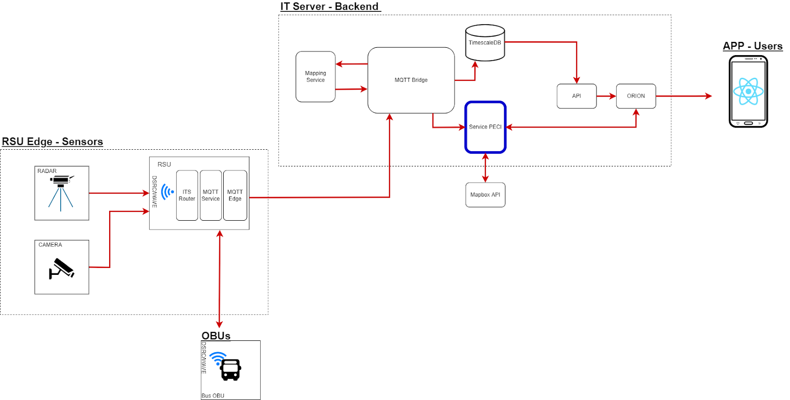

# ATCLL Mobile APP

Smart Mobility & Traffic Prediction App for Aveiro Tech City Living Lab

## Overview

ATCLL Mobile is a mobile application developed for the Aveiro Tech City Living Lab
 (https://www.aveirotechcity.pt/pt).
It leverages the city’s advanced communications infrastructure—smart lamp posts, radars, LIDARs, and sensors—to:

- Provide real-time bus tracking and arrival predictions
- Deliver live traffic monitoring with color-coded road conditions

This project was developed as part of the Computer and Informatics Engineering program at the University of Aveiro.

## Problem

Citizens of Aveiro face two key challenges:

- Unreliable bus schedules – Static timetables do not account for delays, forcing commuters to wait unnecessarily.
- Traffic congestion – Certain streets experience heavy traffic at peak times, but citizens lack real-time information to avoid them.

## Objectives

- Bus Tracking & ETA Prediction: Track bus positions in real-time and predict arrival times at stops.
- Live Traffic Analysis: Process radar data to evaluate traffic flow and warn citizens of congestion.

## Methodology & Architecture

### Server & Data Processing

- Hosted in IT servers, running algorithms for bus line detection, ETA prediction, and traffic analysis.
- Data stored in MongoDB for historical use and future improvements.

### Protocols & Services

- MQTT: Publish/subscribe protocol for real-time bus telemetry.
- Orion Context Broker: Integration layer for handling real-time and historical data.

### Mobile Application (React Native)

- Interactive map showing live bus locations & traffic status
- Bus schedules with ETA at each stop
- Live traffic color-coded by road speed
- About section & system info

## System Architecture

## Features
Bus Tracking & Line Detection

- Real-time bus location updates via MQTT
- Confidence-based line detection algorithm
- ETA prediction using MapBox API
- Continuous service deployed in Docker

Live Traffic

- Processes radar data against historical averages
- Assigns traffic intensity colors (green, yellow, red)
- Stores daily traffic data in MongoDB

Mobile App (React Native)

- Live bus map & line stop details with ETA
- Bus schedules
- Traffic map with congestion colors
- Smooth UI with optimized data requests

## Results

- Successfully achieved real-time bus tracking with ETA predictions
- Developed a live traffic feature integrated into the app
- Extended ATCLL’s smart city infrastructure with mobility-focused solutions

## Future Work

- Provide line detection as an API from Transdev
- Improve bus prediction accuracy with more active smart lamp posts
- Enhance live traffic feature with additional radars
- Further optimize prediction algorithms

## Demo

Watch the full demo here: https://www.youtube.com/watch?v=5ISG9VQtByE

## Authors

Developed by:

- Nuno Cunha
- Alexandre Gago
- Ana Rosa
- Bernardo Kaluza
- Filipe Silveira
- Pedro Lima

Supervised by: Dr. Susana Sargento, Dr. Pedro Rito, Dr. Miguel Luís
University of Aveiro – Department of Electronics, Telecommunications, and Informatics